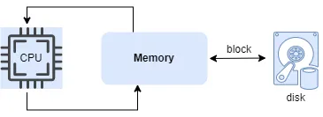

# MergeSortExterno

Uma implementação do merge sort externo, que recebe uma entrada por um arquivo txt.

Lembrem de mudar o nome do arquivo no código caso seja necessário. 

### Funcionamento Merge Sort

# Complexidade

### Heap Min

- Mais eficiente para buscar o valor mínimo ou o máximo

Complexidade: O(n log k)

### Ordenação Inicial (Divisão e Ordenação): 
- O(N log M)
- M = Numero de elementos por arquivo
- N = Numero de elementos totais

### Merge k-Way 
- O(N log k)
- K = Numero de arquivos temporários

### Espaço na Memória:
- O(M): O espaço de memória utilizado é limitado ao tamanho do segmento

### Espaço no Disco:
- O(N): Onde N seria o numero de UUID
